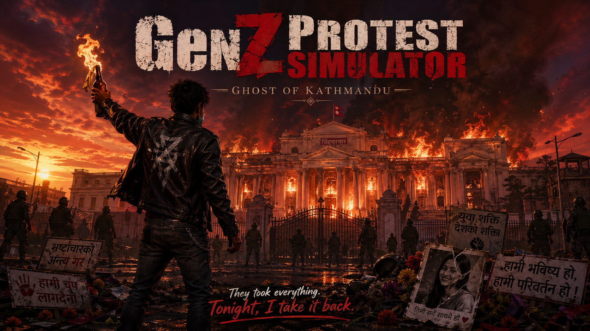

# GenZ Protest Simulator
### Ghost of Kathmandu

> *"They took everything. Tonight, I take it back."*

---

## About

**GenZ Protest Simulator: Ghost of Kathmandu** is a Unity-based narrative simulation inspired by the real protest movements of Nepal. Step into the streets of Kathmandu and experience the struggle, the fire, and the fight for change.

---

## Gameplay

- Explore a protest-torn Kathmandu
- Experience a cinematic intro and outro
- Press **Q** to trigger the ending sequence
- Immersive storytelling driven by real events

---

## Built With

- Unity 6 (URP)
- C#

---

## How to Play

1. Launch the game
2. Click **PLAY** on the main menu
3. Experience the story
4. Press **Q** in-game to trigger the outro

---

## Developer

**Sandesh Basnet**
[GitHub](https://github.com/Sandesh-Basnet)

**Rasik Raj Bista**
[GitHub](https://github.com/RAsikBIsta1581)

---

*Made with passion in Nepal 🇳🇵*
